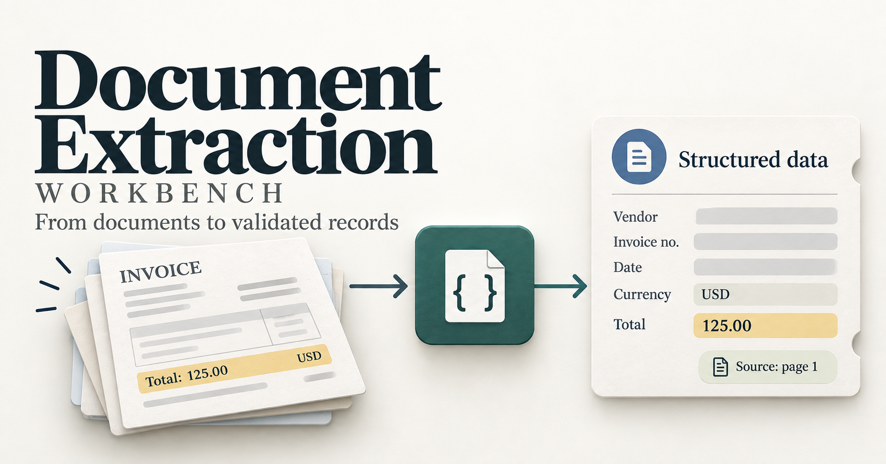

# Document Extraction Workbench

One invoice. Five fields. Rules first, then one model call.

## Demo

Format checks miss a total of 9.00 when the invoice says 90.00. The quote is on the page, and 9.00 is a valid amount. One live model call returns a draft record for a person to review.

## The customer problem

A simulated accounts team copies invoice details into a spreadsheet. Someone reads each invoice and types the vendor, invoice number, date, currency, and total. Amounts get mistyped, and nothing records where each value came from.

Document Extraction Workbench is a portfolio prototype of that draft-record step:

**Read → Extract → Validate → Save → Measure**

The program writes one draft record for a person to inspect. It does not approve a payment or change a live accounting system.

## What it does

- Reads one invoice, as text or as a PDF, from a file
- Fills five fields: vendor, invoice number, date, currency, and total
- Keeps each value with an exact quote and a page number
- Starts with saved mock predictions so the baseline is inspectable
- Normalizes dates, currency codes, and totals in code
- Makes one structured model call and parses the result into a fixed schema
- Saves the validated values and the review reasons as JSON
- Scores predictions against human labels on a development split and a holdout split

## Stack

| Layer | Choice | Why |
| --- | --- | --- |
| Language | Python 3.12 | Reads the document, runs the rules, and calls the API |
| Contracts | Pydantic | Checks required fields and the evidence shape at the boundary |
| Documents | pypdf | Reads text already stored in a PDF |
| Money | Decimal | Keeps totals exact to two decimal places |
| Model | OpenAI structured outputs | One live extraction call with a schema, after the rule checks |
| Config | python-dotenv | Keeps the API key in a local `.env` file |
| Tests | pytest | Locks normalization failures, evidence checks, and the 9.00 miss |
| Data | JSON, text, and PDF files | Sample invoices and labeled cases, with no database |
